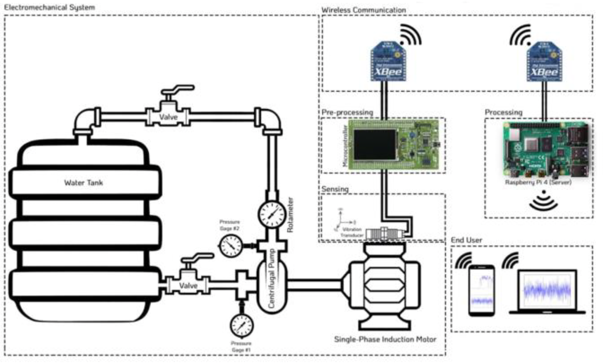
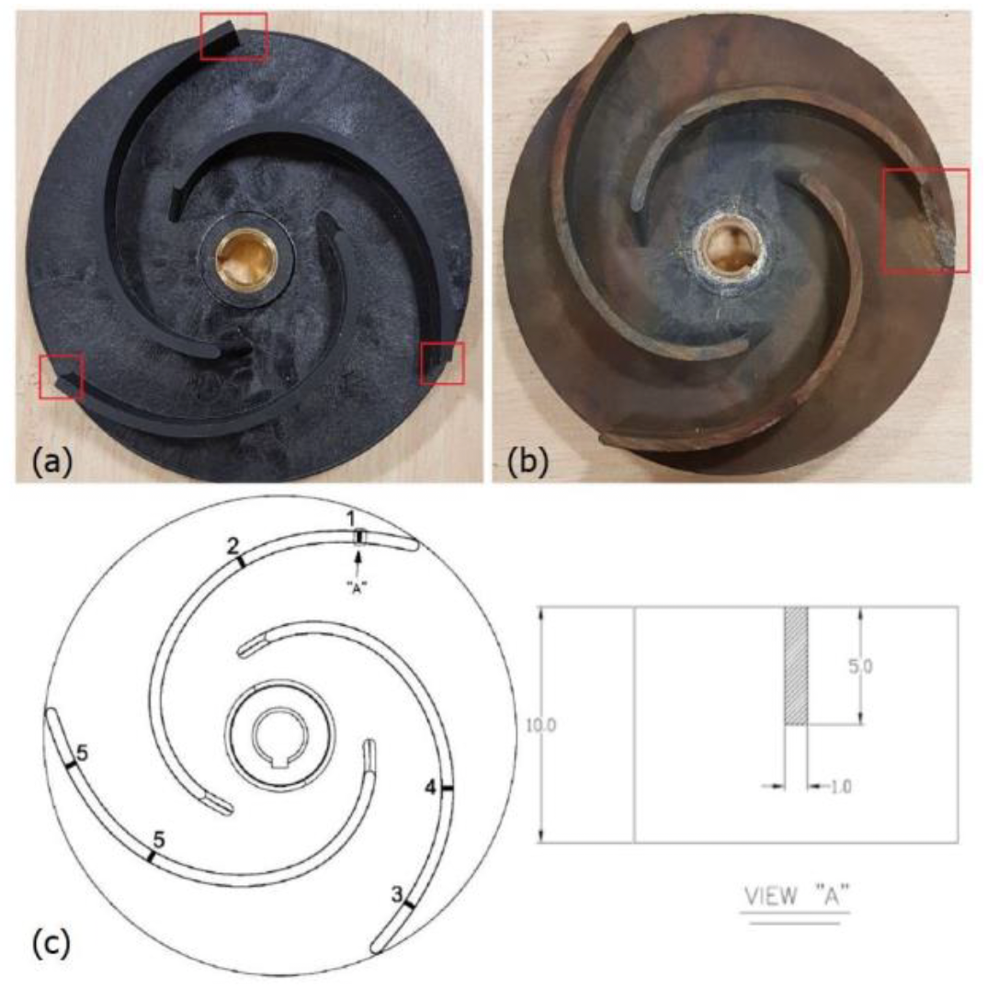

# Intelligent Fault Detection for Centrifugal Pumps

This repository contains the materials and implementation of my undergraduate capstone project titled **"An Intelligent Approach to Detecting Novel Fault Classes for Centrifugal Pumps"**, which was presented at the **7th International Conference on Signal Processing and Intelligent Systems (ICSPIS).** The project leverages **Deep Convolutional Neural Networks (CNNs)** and **unsupervised clustering** techniques to identify both known and novel fault conditions in centrifugal pumps.

  

---

## Project Overview

Condition monitoring of centrifugal pumps is crucial for improving reliability and reducing maintenance costs. In industrial settings, predicting failures accurately can prevent unexpected downtimes and costly repairs. The proposed approach integrates:
- Deep CNNs for fault classification
- t-SNE for dimensionality reduction
- K-Means clustering for novel fault detection
- A real-time experimental setup to validate the methodology

### **Objectives**
- Develop a robust fault detection system for centrifugal pumps.
- Train a CNN model using labeled vibration data to classify known faults.
- Identify novel faults using unsupervised clustering techniques.
- Implement an online monitoring system to augment the model with new fault classes.

---

## Project Components

### **1. Methodology**
The project consists of a two-stage fault detection approach:

1. **Stage 1: Supervised CNN Training**
   - Training a Wide Deep Convolutional Neural Network (WDCNN) on known fault classes.
   - Using vibration signals as input.
   - Feature extraction using convolutional layers and classification.

2. **Stage 2: Novel Fault Detection**
   - Dimensionality reduction using t-SNE to visualize fault clusters.
   - Applying K-Means clustering to detect and label new fault conditions.
   - Model augmentation for continuous learning.

---

### **2. Experimental Setup**
The experimental setup for the project includes:

- **Centrifugal Pump System:**  
  - A 1-hp, single-phase induction motor-driven pump.
  - Controlled inlet and outlet valves for fault simulation.

- **Data Acquisition System:**  
  - LIS3DSH accelerometer module (sampling at 1.6 kHz).
  - STM32F4 microcontroller for data processing.
  - XBee modules for wireless data transmission to a Raspberry Pi.

- **Software Architecture:**  
  - Data collection and storage using InfluxDB.
  - Preprocessing with Python for normalization and reshaping.
  - Online monitoring dashboard with Grafana.

---

## Dataset Overview

The dataset used for training and testing consists of vibration signals for six pump conditions:

| Fault Type        | Training Samples | Testing Samples | Flow Range (L/min) |
|------------------|-----------------|----------------|------------------|
| Healthy          | 1460             | 360            | 170 - 220        |
| Low Flow Rate    | 1120             | 280            | 80 - 120         |
| Cavitation       | 1440             | 360            | 120 - 170        |
| Major Defect     | 1440             | 360            | 150 - 200        |
| Minor Defect     | 1040             | 360            | 130 - 160        |
| Crack            | 1280             | 320            | 150 - 200        |

  

---

## Results

The proposed system was evaluated based on the collected vibration data, and the following key performance results were achieved:

1. **Fault Classification Accuracy:**
   - The CNN model achieved an overall accuracy of **96.5%** on known fault classes.
   - The confusion matrix demonstrated precise classification with minimal misclassification across different fault types.

2. **Novel Fault Detection:**
   - t-SNE visualization successfully clustered known faults while revealing distinct patterns for novel conditions.
   - The K-Means clustering algorithm achieved a **90% success rate** in detecting previously unseen faults.

3. **Performance Metrics:**
   - **Precision:** 95.2%  
   - **Recall:** 96.8%  
   - **F1-score:** 96.0%  
   - **Mean Squared Error (MSE):** 0.02

---

## Conclusion

The proposed intelligent fault detection system successfully classified known fault conditions with high accuracy and demonstrated the capability to identify novel faults using clustering techniques. The two-stage approach combining deep learning and unsupervised clustering proved to be effective in real-world applications, providing a robust and scalable solution for centrifugal pump condition monitoring.

Key outcomes of the project include:

- A high-accuracy deep learning model capable of distinguishing between multiple fault classes.
- A novel fault detection mechanism using clustering techniques to recognize unseen conditions.
- An adaptive system that can integrate new fault data over time, enhancing its predictive capabilities.
- Successful real-time implementation with a wireless sensor network for data collection.

The results highlight the potential of AI-driven fault diagnosis systems to improve industrial reliability and efficiency.

---

## Publication

The findings of this project have been published in the **7th International Conference on Signal Processing and Intelligent Systems (ICSPIS)**.

**Citation:**
M. A. Chalaki, D. Maroufi, M. Robati, M. J. Karimi and A. Sadighi, "An Intelligent Approach to Detecting Novel Fault Classes for Centrifugal Pumps Based on Deep CNNs and Unsupervised Methods," 2021 7th International Conference on Signal Processing and Intelligent Systems (ICSPIS), Tehran, Iran

[Read the Paper](https://doi.org/10.1109/ICSPIS54653.2021.9729350)

---

## License

This project is licensed under the MIT License. See the [LICENSE](LICENSE) file for details.

---

## Contact

For any questions or collaboration inquiries, feel free to reach out.
